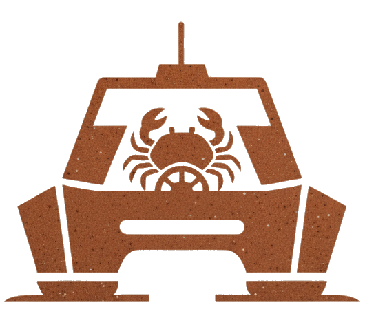

> ---
>
> ### **Notice: Pre-Release Alpha Software**
>
> This repository contains an early, pre-release version of Ferri and should be considered **alpha-quality software**.
>
> We are currently in the middle of a major architectural refactor to make the workflow engine more powerful and secure. We're too busy breaking things and rebuilding them into something better to guarantee stability right now.
>
> * **✅ Layer 1 (`init`, `with`, `ctx`, etc.):** Stable and ready for use.
> * **⚠️ Layer 2 & 3 (`flow`, `do`):** Highly volatile. Here be dragons.
>
> * **Stability:** The software is not stable and is not suitable for production use.
> * **Breaking Changes:** The API, command structure, and workflow schemas are under active development and are subject to change without notice in future updates.
> * **Feedback:** This version is released for evaluation and feedback purposes. Please report any bugs or suggestions by opening an issue or contacting us at **[me@jorgeajimenez.com](mailto:me@jorgeajimenez.com)** or **[me@gretchenboria.com](mailto:me@gretchenboria.com)**.
>
> ---

# Ferri

<div align="center">
  
</div>

[](https://github.com/ferri-tools/ferri/blob/main/LICENSE)
[](https://github.com/ferri-tools/ferri/projects)

Ferri is a local-first AI toolkit that acts as an intelligent director for foundation models. It evolves from a simple command runner into a proactive, agentic partner that can plan and execute complex development tasks.

Ferri creates secure, project-based environments with portable context, unifying your workflow across local (Ollama) and remote (API) models. The goal is to let you focus on your high-level goals, not on the minutiae of context management and command execution.

## Core Concepts

* **Project-Based:** Ferri operates within your project directory, keeping all context, secrets, and job history in a local `.ferri` directory.
* **Context-Aware:** You tell Ferri what files are important (`ferri ctx add`), and it automatically injects them into your AI prompts.
* **Secure:** Secrets like API keys are encrypted and automatically made available to commands, so you never have to expose them in your shell.
* **Layered Architecture:** Start with simple commands and gradually adopt more powerful, automated, and agentic features as you need them.

## The Ferri Architecture

Ferri is built in layers, allowing you to choose the right level of power for your task.

| Layer | Command(s) | Description |
|---|---|---|
| **L1: Core Execution** | `init`, `secrets`, `models`, `ctx`, `with` | The foundation. Manages your environment, models, and executes synchronous, single-shot commands. |
| **L2: Workflow Automation** | `run`, `ps`, `yank`, `flow` | The automation layer. Runs commands as background jobs, monitors their status, and orchestrates multi-step workflows. |
| **L3: Agentic Engine** | `do` | The intelligent director. Takes a high-level goal, formulates a multi-step plan, and executes it. |

## Roadmap
* ✅ **L1: Core Execution:** Stable and ready for use.
* 🏗️ **L2: Workflow Automation:** Undergoing a major architectural refactor for enhanced security and scalability.
* 🤔 **L3: Agentic Engine:** In design and prototyping phase.

---

## Quick Start: Your First Workflow

Before diving into the commands, here are the three essential steps to run your first AI workflow, like the code review demo at the end of this guide.

**1. Initialize Your Project**

Navigate to your project's root directory and run `init`. This creates the `.ferri` directory to store all local context, secrets, and job history.

```bash
cd my-project
ferri init
````

**2. Store Your API Key**

Ferri keeps secrets encrypted locally. Use the `secrets set` command to securely store your Google API key. You will be prompted to enter the key interactively.

```bash
ferri secrets set GOOGLE_API_KEY
# Follow the prompt to enter your key
```

**3. Register the Model**

Tell Ferri about the model you want to use. This command creates a local alias (`gemini-pro`) and links it to the specific Google model and the API key you just stored.

```bash
ferri models add gemini-pro \
  --provider google \
  --api-key-secret GOOGLE_API_KEY \
  --model-name gemini-1.5-pro-latest
```

You are now fully configured to use the `gemini-pro` model in any `ferri` command.

-----

## Command Reference

| Command | Description |
|---|---|
| `init` | Initialize a new Ferri project in the current directory. |
| `secrets` | Manage encrypted, project-specific secrets like API keys. |
| `models` | Manage the registry of local (Ollama) and remote (API) models. |
| `ctx` | Manage the project's context from files or job outputs. |
| `with` | Execute a command within a context-aware, synchronous environment. |
| `run` | Run a command as a long-running background job. |
| `ps` | List and manage active background jobs. |
| `yank` | Fetch the output (stdout) of a completed background job. |
| `flow` | Define and run multi-step, declarative AI workflows from a file. |
| `do` | Execute a high-level goal with an AI-powered agentic engine. |

-----

## Use Cases & Examples

This section provides a command-by-command breakdown of Ferri's capabilities, each with practical, real-world examples.

### `ferri init`

Initializes a new Ferri project. This creates the `.ferri` directory where all project-specific state, context, secrets, and configurations are stored.

**Use Case: Starting a New Project**

```bash
# Navigate to your project's root directory
cd my-new-app

# Initialize Ferri
ferri init
# Output: ✨ Successfully initialized Ferri project in ./.ferri
```

-----

### `ferri secrets`

Manages encrypted, project-specific secrets like API keys. Secrets are stored locally and are never committed to source control.

**Use Case: Storing API Keys for Remote Models**

```bash
# Securely store your Google API key. You will be prompted for the value.
ferri secrets set GOOGLE_API_KEY

# Securely store another key non-interactively.
ferri secrets set ANTHROPIC_API_KEY="sk-ant..."
```

-----

### `ferri models`

Manages the registry of available models. Ferri features a unified model system that automatically discovers local Ollama models and allows you to register remote, API-based models.

**Use Case: Listing All Available Models**

```bash
ferri models ls
```

**Use Case: Registering a New Remote Model**

```bash
# Register the Claude 3 Opus model
ferri models add claude-opus \
  --provider anthropic \
  --api-key-secret ANTHROPIC_API_KEY \
  --model-name claude-3-opus-20240229
```

-----

### `ferri ctx`

Manages the project's context (the files and data provided to the AI).

**Use Case: Adding Files and Directories to the Context**

```bash
ferri ctx add ./src README.md
```

-----

### `ferri with`

Executes a command, injecting secrets and context. This is Ferri's core execution engine.

**Use Case: Switching Seamlessly Between Models**

```bash
ferri with --ctx --model gemma:2b "Explain the purpose of the main function."

ferri with --ctx --model gemini-pro "Explain the purpose of the main function."
```

-----

### `ferri run`, `ps`, and `yank`

Manages long-running, asynchronous background jobs.

**Use Case: Generating Documentation in the Background**

```bash
# Start a long-running job
ferri run --ctx --model gemini-pro "Generate a complete project summary in Markdown"
# Output: Job submitted: job-b4c5d6

# Check the status
ferri ps

# Retrieve the output when complete
ferri yank job-b4c5d6 > PROJECT_SUMMARY.md
```

-----

### `ferri flow`

Defines and runs multi-step, declarative AI workflows from a YAML file. The `ferri flow` schema is heavily inspired by industry standards like Kubernetes and GitHub Actions, providing a powerful, secure, and scalable way to orchestrate complex tasks.

**Use Case: Automating Code Generation and Testing**

```yaml
# ci-prep.yml
# The top-level structure enables versioning and tooling.
apiVersion: ferri.flow/v1alpha1
kind: Flow
metadata:
  name: "prepare-for-ci"

# The 'spec' block defines the workflow's desired state.
spec:
  # 'workspaces' define shared filesystems for jobs.
  workspaces:
    - name: "source-code"

  # 'jobs' are collections of steps that can run in parallel.
  jobs:
    generate-docs:
      name: "Generate Documentation"
      runs-on: "ubuntu-latest"
      # 'steps' are executed sequentially within a job.
      steps:
        - name: "Generate docs from source code"
          workspaces:
            - name: "source-code"
              mountPath: "/app"
          # The 'run' key contains the command to execute.
          run: 'ferri with --ctx /app/src --model gemini-pro "Generate docs" > /app/DOCS.md'

    write-tests:
      name: "Write Unit Tests"
      runs-on: "ubuntu-latest"
      # 'needs' creates a dependency, ensuring this job runs after 'generate-docs'.
      needs: [generate-docs]
      steps:
        - name: "Write tests based on the new docs"
          workspaces:
            - name: "source-code"
              mountPath: "/app"
          run: 'ferri with --ctx /app/DOCS.md --model gemini-pro "Write unit tests" > /app/main.test.js'
```

```bash
# Execute the entire workflow
ferri flow run ci-prep.yml
```

-----

### `ferri do`

Executes a high-level goal with an AI-powered agentic engine.

**Use Case: Agentic Code Modification**

```bash
ferri do "Add a new '/api/users' endpoint to my Express app. It needs a route, a controller with a placeholder, and must be registered in the main app file."
```

-----

## Command Modifiers

For a detailed list of all command modifiers and advanced options (e.g., `--stream`, `--dry-run`, `--interactive`), see [COMMAND\_MODIFIERS.md](https://www.google.com/search?q=./COMMAND_MODIFIERS.md).

-----

## Demo: AI-Powered Code Review

This demo showcases a workflow where a fast, local model (Gemma) and a powerful, remote model (Gemini Pro) work together to perform a code review.

**1. Setup:**

Follow the **Quick Start** guide above to initialize your project and register the `gemini-pro` model.

**2. Run the Flow:**

Execute the `code_review_flow.yml` pipeline. This flow uses the `engineering/demos/demo_script.py` file as its input.

```bash
ferri flow run project_resources/engineering/demos/code_review_flow.yml
```

**3. What it Does:**

  * **Step 1 (Local - Gemma):** Performs a quick "triage" on `demo_script.py` and writes a summary to `triage_report.txt`.
  * **Step 2 (Remote - Gemini Pro):** Uses the triage report to perform a deep analysis and writes an enhanced, secure version of the script to `enhanced_script.py`.
  * **Step 3 (Local - Gemma):** Reads the final code and generates a git commit message in `commit_message.txt`.

-----

## Community

Have questions, ideas, or just want to chat with other users and developers? Join our Discord server\!

Join the Conversation at https://discord.gg/H8qXs9gx
